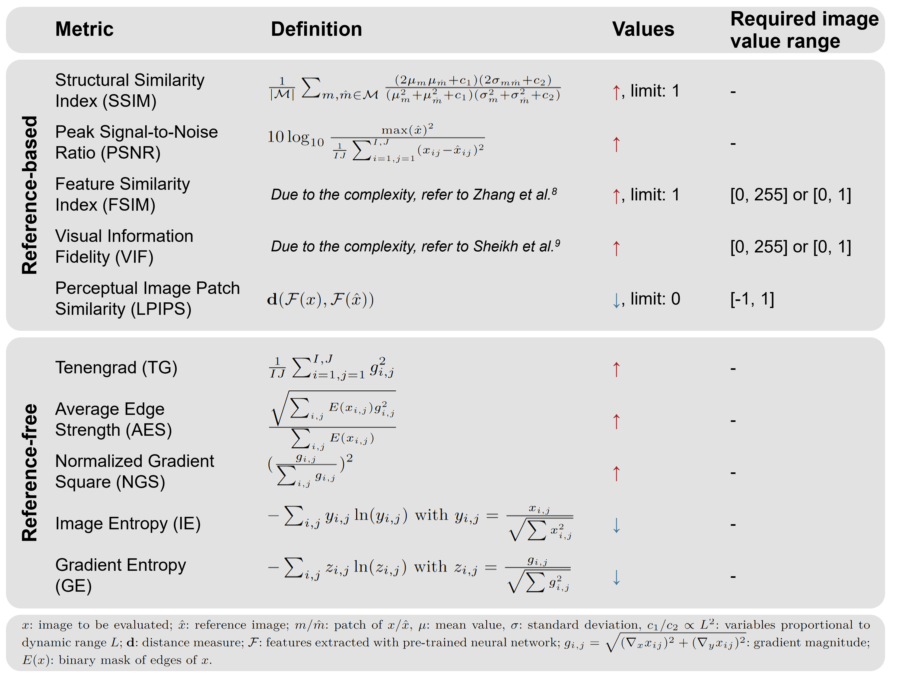
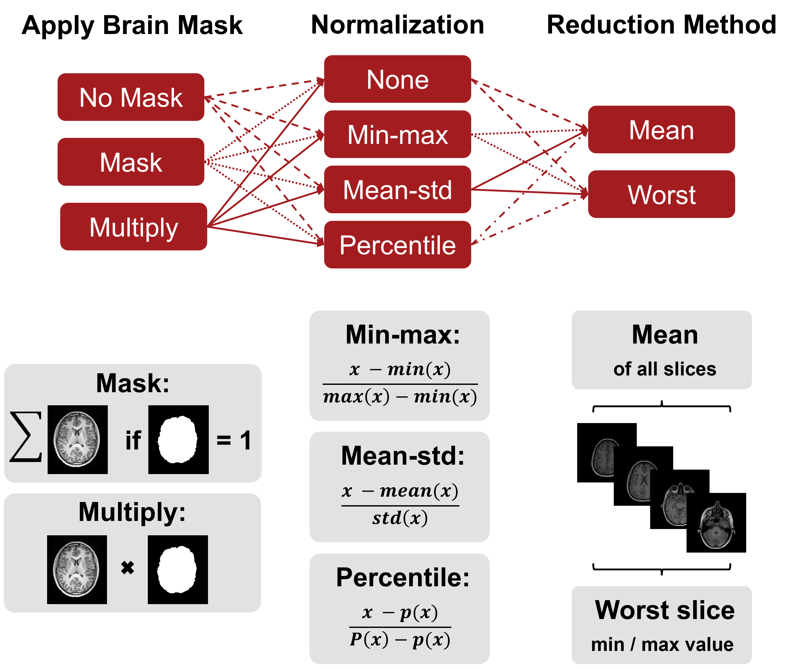
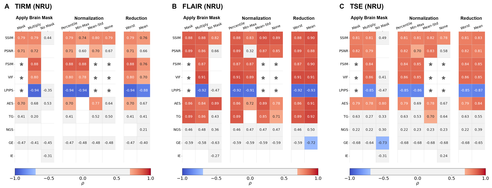

# ImageQualityMetricsMRI
**Assessing the Influence of Preprocessing on the Agreement of Image Quality Metrics with Radiological Evaluation in the Presence of Motion**

Published in MAGMA:
Marchetto, E., Eichhorn, H., Gallichan, D. et al. Agreement of image quality metrics with radiological evaluation in the presence of motion artifacts. Magn Reson Mater Phy (2025). https://doi.org/10.1007/s10334-025-01266-y
Available [here](https://link.springer.com/article/10.1007/s10334-025-01266-y).
Preprint available [here](https://arxiv.org/abs/2412.18389).

## Educational talk "Motion in MRI - Challenges, Strategies & Quality Evaluation"
We were invited to present our work on image quality evaluation at the MR Educational Series of the
British and Irish Chapter of the ISMRM on April 4th, 2025. You can find the corresponding slides `Motion_in_MRI.pdf` 
in this repository. The recording is available on the [British and Irish Chapter's website](https://www.ismrm.org/british/2025-bic-edu-winter.htm).


## Abstract accepted at ISMRM 2025 (#0336, Magna Cum Laude Merit Award)
Hannah Eichhorn*, Elisa Marchetto*, Daniel Gallichan, Julia A. Schnabel, Melanie Ganz

**Digital Poster Video available in the main folder (file name: digital_poster_ismrm25.mp4).**

- _Motivation:_  Reliable image quality assessment is essential for improving motion correction methods. However, common image quality metrics (IQMs) often show inconsistent agreement with radiological evaluations and lack standardization in preprocessing techniques.

- _Goal(s):_ Evaluating the correlation of ten common IQMs with radiological assessments and investigating how preprocessing steps affect these correlations.

- _Approach:_ We compare the IQMs on two brain imaging datasets with real motion artifacts and analyze the effects of preprocessing choices like normalization, region-of-interest masking and slice reduction.

- _Results:_ Reference-based IQMs exhibit stronger, more consistent correlations with radiological assessments than reference-free IQMs. Preprocessing steps, particularly normalization and brain masking, significantly influence the correlation.

- _Impact:_ This study underscores the critical role of preprocessing choices for reliable image quality evaluation. We strongly recommend documenting all preprocessing steps in future studies. Our results further demonstrate that reference-based metrics correlate more reliably with radiological assessments than reference-free metrics.


#### Figures

Overview of the five reference-based and five reference-free IQMs used in this study. From left to right: full name of the metric, mathematical definition, whether values increase or decrease with increasing image quality, and whether the input image is expected to be in a certain intensity range. For further details we refer the reader to each metric’s reference. 




Illustration of preprocessing steps required for calculating the IQMs. The brain mask can either be neglected (“None”), used to mask the metric values (“Mask”) or multiplied to the image before calculating IQMs (“Multiply”). For normalization, we tested “None”, “Min-max”, “Mean-std” and “Percentile” normalization, using the 1st and 99.9th as lower and upper percentiles p and P. The metric value for the whole volume can be calculated by either reducing to the mean over all slices or taking the worst slice (min / max depending on IQM).

 

#### Supplementary Figures



## How to use this repository
### Setting up the Conda environment

1. Clone this repository and navigate to the project directory in your terminal.

3. Create the Conda environment from the `environment.yaml` file:

```bash
conda env create -f environment.yml
```

4. Activate the Conda environment:

```bash
conda activate dev_iqm
```

5. For installing FSL (to use BET and FLIRT tools for brain mask extraction and registration), follow these instructions: https://fsl.fmrib.ox.ac.uk/fsl/fslwiki/FslInstallation

6. You're all set! You can now run the scripts in this project.


### Steps to reproduce the analysis

1. Download and preprocess the data with:
```
conda activate dev_iqm
nohup python -u preprocessingData.py > preprocess_data.log &
```

2. Calculate the image quality metrics for all subjects with:
```
conda activate dev_iqm
nohup python -u process_all_subjects.py > Results/log.txt &
```
One can set specific preprocessing settings for `normalisation`, 
`mask_metric_values`, `reduction`, `apply_brainmask` as input arguments. 
- `run_process_all_subjects.sh`is a bash script to run different settings sequentially.

3. Analyse the correlation between the image quality metrics and the observer
scores with the script `analysis_scripts/correlation_analysis.py`.


4. Compare correlations between different preprocessing settings with 
`analysis_scripts/compare_preprocessing.py` and between different datasets with 
`analysis_scripts/compare_datasets.py`.

